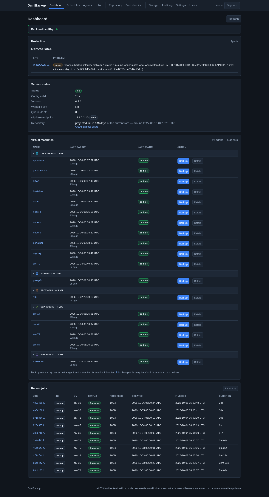

# Sitebound Backup

A self-hosted backup system built as **one manager and many agents**: the manager
holds the schedules, the catalogue and the web interface; each agent backs up
what it sits next to — a vSphere estate, a Hyper-V host, a Proxmox node, a Docker
host, physical Windows computers — into **its own site's storage**, and reports
back. Backups never cross a site boundary, and neither do restores.

> **This repository is a published excerpt.** It holds the **Docker agent's
> capture core** (Python), its install files and its documentation, so the design
> can be read and discussed. It is not the whole product and is not meant to run
> on its own: the manager, the job runner and the other agents are described below
> but not included. The full system runs in production on a private estate.

Licensed under the [GNU AGPL-3.0](LICENSE).



*The manager's dashboard, shown with example data. Every page: [docs/SCREENSHOTS.md](docs/SCREENSHOTS.md).*

---

## What the whole system does

### Agents

| Agent | Captures | How |
|---|---|---|
| **vSphere** | VMs through vCenter or ESXi | Snapshot, VDDK over NBD, raw sparse images; **true incrementals** from Changed Block Tracking; the VM's definition (`.vmx`, `.nvram`) kept per run |
| **Hyper-V** | VMs on a Windows Hyper-V host | The host pushes a frozen VHDX (checkpoint) to the agent over **SFTP only, in a chroot**; the agent stores it as a raw sparse image |
| **Proxmox VE** | QEMU guests | The node's own `vzdump` writes to an NFS storage that *is* the agent's share; the agent streams the VMA archive through its **own VMA reader** into one raw sparse disk per device plus the guest's config |
| **Docker** | Compose projects and standalone containers | Each volume and bind mount as `tar` + zstd, the project's definition (inspects, Compose files, `.env`), locally built images by `docker save`; **dump / pause / stop / crash** consistency per project — *this repository* |
| **Windows computers** | Physical PCs and laptops, including Windows Home | Windows' own system-image backup (`wbadmin`, VSS) onto a **per-computer iSCSI LUN** that is enabled only while the image is taken; older versions kept as shadow copies on the LUN |

**Planned agents**, built the same way (own site, own storage, restores always
into a new VM with the network off):

* **libvirt / KVM** on plain Linux hosts: `virsh backup-begin` over NBD, with
  checkpoints for true incrementals; boot checks through the QEMU guest agent.
* **XCP-ng** (XAPI): snapshot and raw export of each disk, changed-block tracking
  for incrementals; boot checks through the guest tools.
* **KubeVirt** (possibly): VM snapshot and export from inside the cluster with a
  narrowly scoped service account; restores and boot checks in an isolated
  namespace.

### Integrity, every step

* **A digest per stored file**, recorded when it is written, with an **extent
  map** of where its data is, so verification reads data rather than holes.
* **Verify on request**, and a **daily sweep on every agent** that re-reads every
  stored run against its recorded digests; the manager alarms on damage, a failed
  sweep, or a sweep that stopped happening.
* **Boot checks**: a stored image is restored into a throwaway VM **with no
  network**, started, and judged by what the guest itself says (VMware Tools,
  Hyper-V integration services, the QEMU guest agent) — passed, failed, or
  inconclusive, never guessed.
* **Chains kept whole**: retention keeps complete chains; a delta is never kept
  without its full, and a full is never pruned while a delta needs it.

### Restore

* **Whole machines, always as a new VM**: never over the original, under a name no
  VM has, on a scratch datastore, **network disconnected and powered off** unless
  asked — and never powered on *and* connected in one step. Checked on the VM in
  vSphere before any power-on, not just written into its config.
* **A plan first**: every restore can be planned (chain, missing images, space)
  without writing anything.
* **File-level restore** on a per-site **restore workstation** (an RDP desktop):
  `vmbackup-browse open <machine>` opens a backup read-only in seconds — VM disks
  through libguestfs, a Windows computer's backup through every layer of its LUN
  (and older versions through its shadow copies), a vSphere incremental as its
  whole chain served as one disk without copying it — from a share the NAS
  itself keeps read-only. For administrators there is an **"Open a backup"**
  desktop menu: pick the machine, then the date (newest first, marked full or
  incremental), and the file manager opens on that backup; a right-click
  **Copy to scratch** takes files out, and the last few backups reopen in one
  step. Each site's workstation is built by **one script** onto its own
  hypervisor, and it mounts the repository only after proving the NAS refuses a
  write.

### The manager

* Schedules per machine, sent to the right agent as **typed jobs** — an intent
  with a closed set of parameters, never a command; an agent refuses anything
  else by name.
* A web interface: dashboard, schedules, agents, jobs, repository, boot checks,
  restore (from the manager or from an agent), storage, audit log, users and roles.
* Notifications (email/webhook), a daily digest, and monitoring figures.
* Its own configuration and history backed up beside the images, with the
  **secrets sealed** (CMS, AES-256) to a certificate whose private key is kept
  off the appliance and off the NAS.

### Security model

* **Agents are reached by narrow SSH keys**: one key can only read the report,
  one can only hand over a job, one can only deliver an update bundle (checked
  file by file against its checksums, installed by a root-owned script that is
  the account's only `sudo` rule) — each accepted only from the manager's address.
* **Site-bound storage**: each agent's repository is its own NAS export, admitted
  to that agent alone; a restore workstation gets its own **read-only** export.
* Hosts are pinned: vCenter, Proxmox and WinRM endpoints by certificate
  fingerprint.

---

## What is in this repository

```
src/sitebound/
  dockercapture.py     capture one Docker project: definition, data, images, dumps
  docker_inventory.py  list the host's projects and their mounts
  digest.py            the file and sparse digests every run records
  chains.py            how runs group into chains for retention
  util.py, errors.py   small shared pieces
tests/                 tests of the capture (pytest; they run against src/)
deploy/docker/         the agent's installer, systemd units, example projects.yaml,
                       and the update channel (push-update.sh and the two
                       scripts on the agent side)
docs/CONTAINERS.md     the Docker agent's design
docs/ARCHITECTURE.md   the manager, the agents, the job protocol
docs/SCREENSHOTS.md    every page of the web interface, with example data
```

Internally the product is called `vmbackup` (its first life was a VMware
appliance), which is why paths and units say `/etc/vmbackup`, `vmbackup-jobs`.

Running the tests: `python -m pytest tests` (Python 3.9+, `pytest`).
