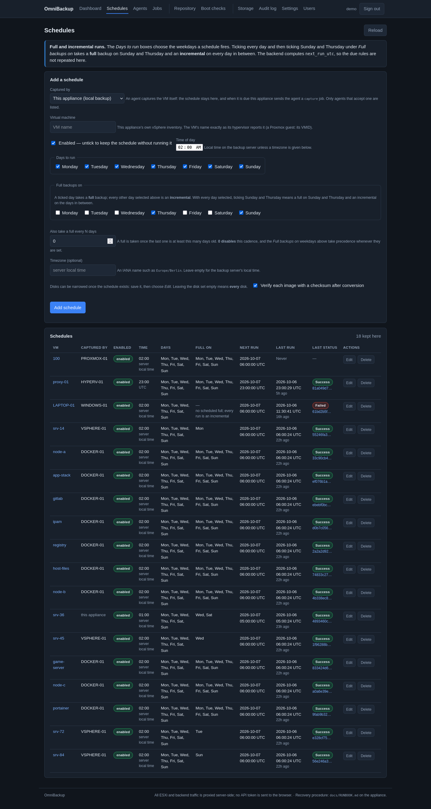
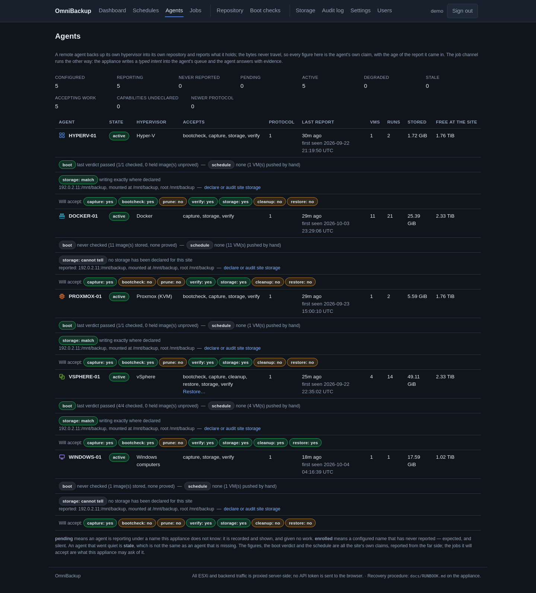
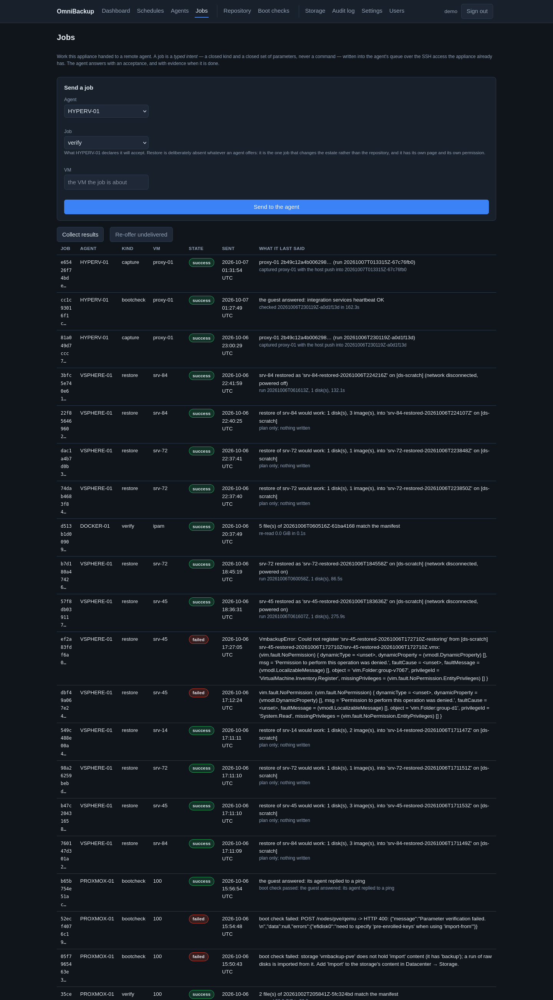
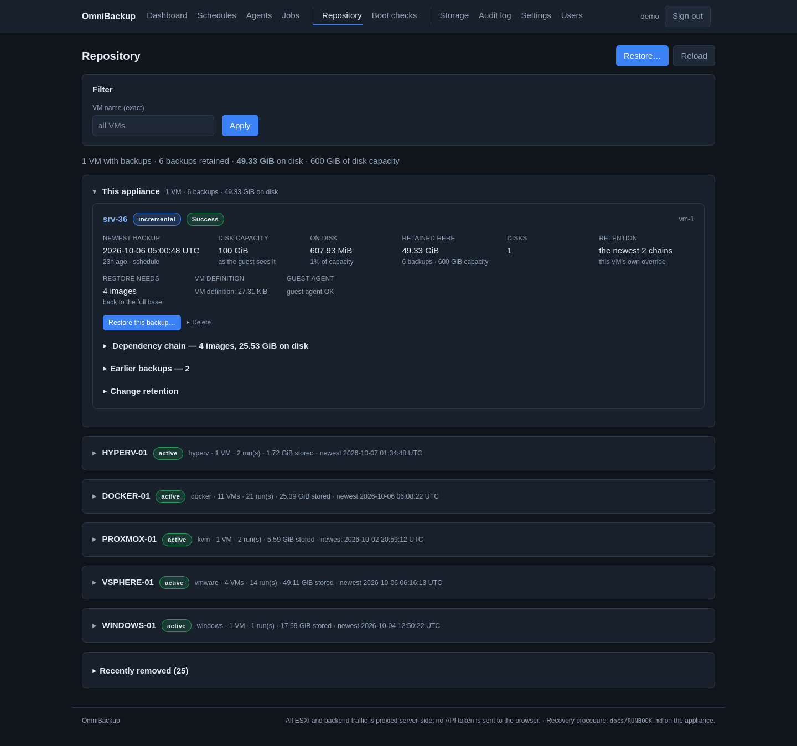
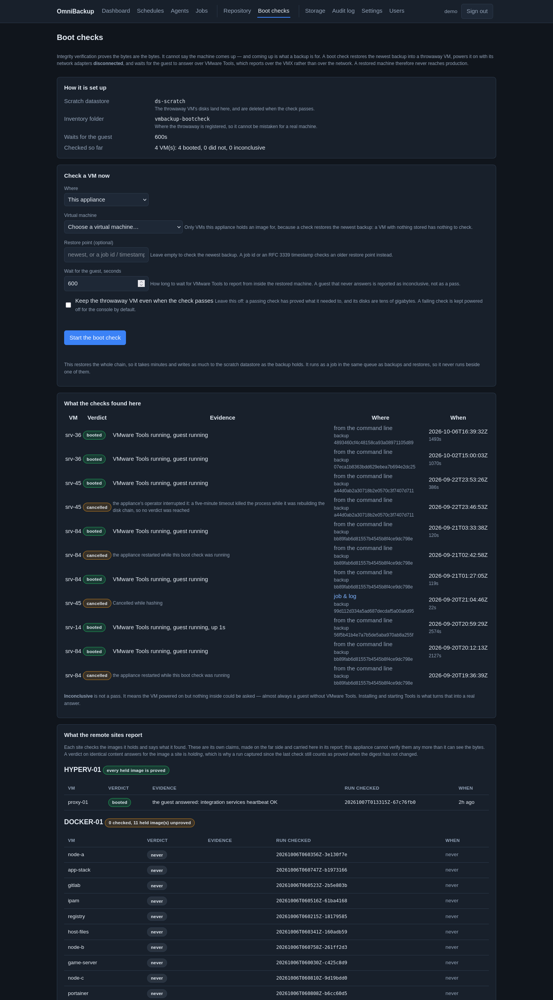
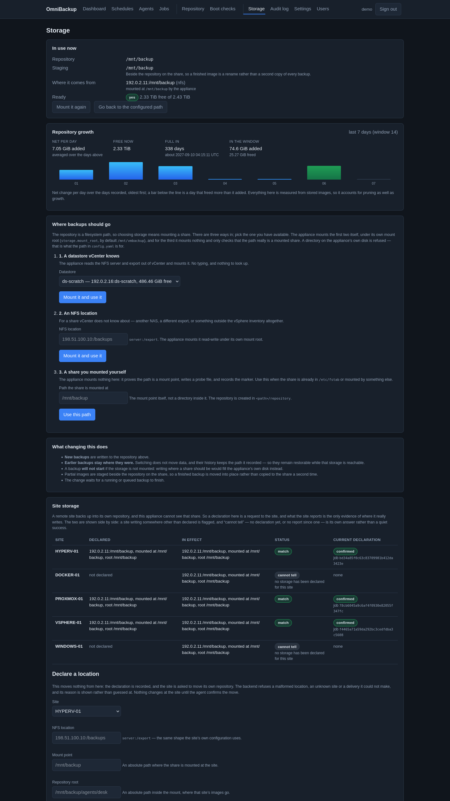
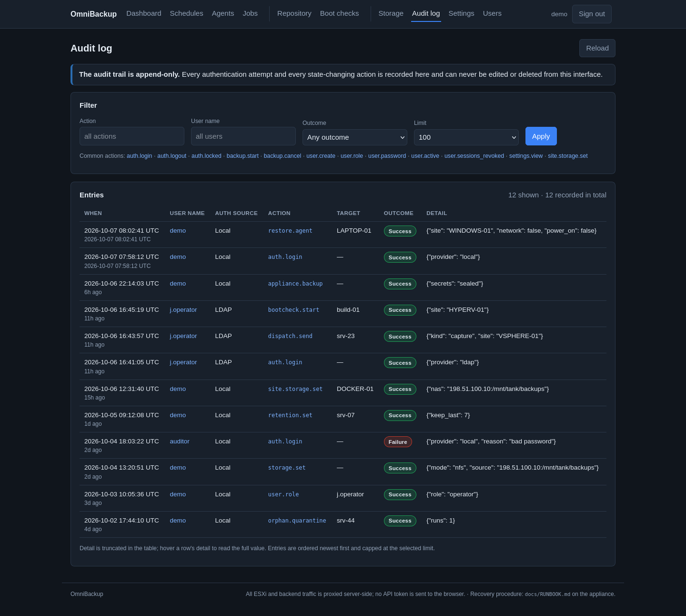
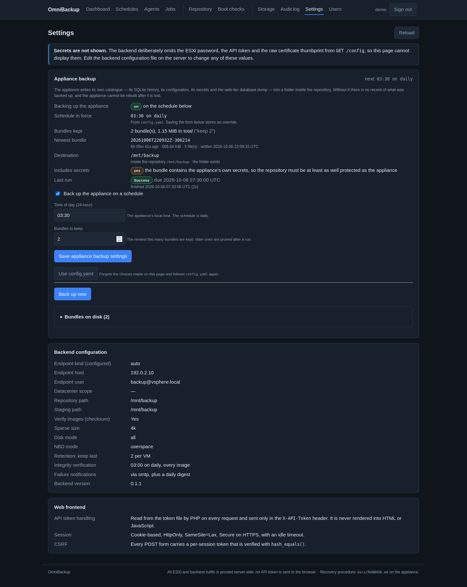
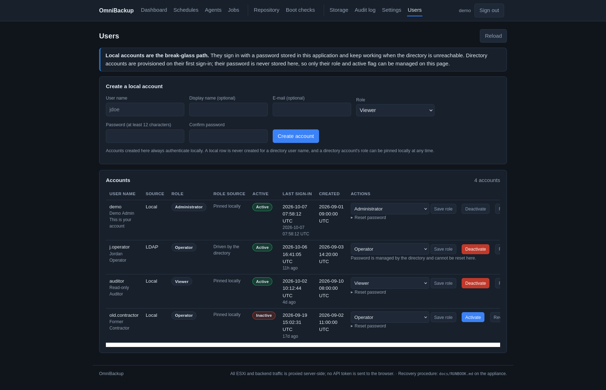

# Screenshots

Every page of the manager's web interface, rendered by the real page code with
**example data**: the machines, sites, addresses, paths, digests, accounts and
audit entries are made up. Addresses are from the documentation ranges
(192.0.2.0/24, 198.51.100.0/24).

## Dashboard
Health, the protection alerts raised from every site's own reports, the machines
by agent, recent jobs.

## Schedules
Per-machine schedules — full and incremental days, captured here or by an agent.

## Agents
Each site's agent: what it reports, what it will accept, where it writes, boot verdicts.

## Jobs
Typed jobs handed to the agents, and what each agent answered (top of a long page).

## Repository
Stored backups per agent, chains, retention, restore.

## Boot checks
A backup restored into a throwaway VM with no network, started, and judged by the guest (top of a long page).

## Storage
The manager's repository, its growth, and each site's declared storage (top of a long page).

## Audit log
Every sign-in and state-changing action.

## Settings
The manager's own backup (secrets sealed to an offline certificate) and its configuration.

## Users
Local break-glass accounts and directory accounts, by role.

